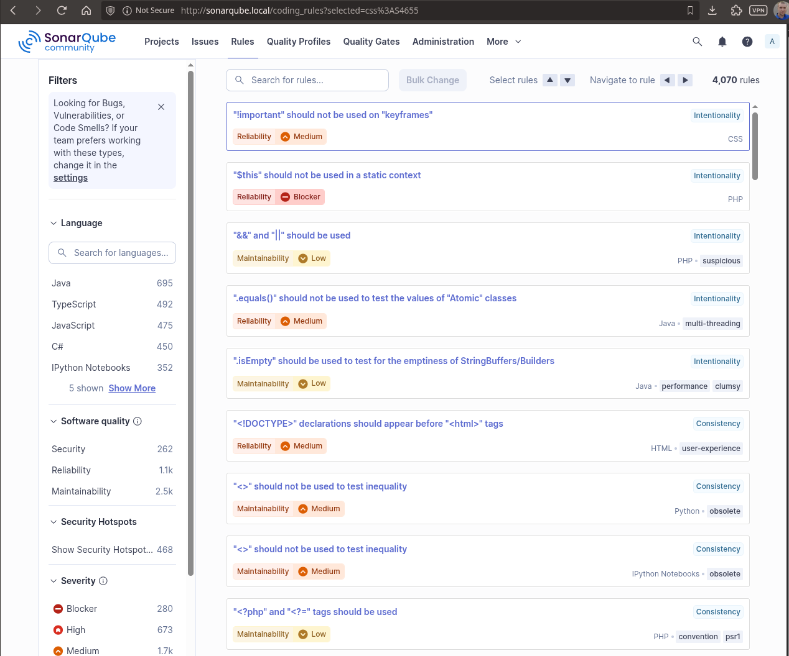
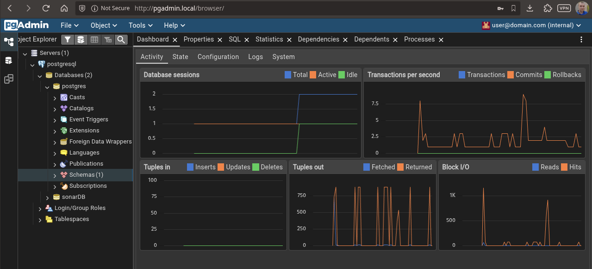

# SonarQube on Kubernetes Kind Cluster

## About the Project

This project automates the setup of a local Kubernetes cluster using Kind (Kubernetes in Docker) and deploys SonarQube with PostgreSQL backend. It provides a complete code quality analysis environment in a Kubernetes cluster with web-based interfaces for both SonarQube and PostgreSQL management.

## Components

- **Kind**: Local Kubernetes cluster running in Docker
- **SonarQube**: Open-source code quality platform with static analysis
- **PostgreSQL**: Database backend for SonarQube
- **pgAdmin**: Web UI for PostgreSQL database management
- **Nginx Ingress**: Routes traffic to SonarQube and pgAdmin

## Quick Start

### Screenshots

* A SonarQube instance is up and running within the Kubernetes cluster.
* The SonarQube instance is accessible via an HTTP endpoint exposed by the ingress controller.

#### SonarQube Dashboard


#### pgAdmin Dashboard



### Installation

Run the automated setup script:
```bash
bash launch.sh
```

The script will:
1. Install Kind (Kubernetes in Docker)
2. Create a Kubernetes cluster with port mappings
3. Deploy Nginx Ingress controller
4. Install PostgreSQL with persistent storage
5. Deploy SonarQube with database configuration
6. Deploy pgAdmin for database management

### Access Services

After installation completes, add these entries to your `/etc/hosts`:

```bash
echo "127.0.0.1  sonarqube.local" | sudo tee -a /etc/hosts
echo "127.0.0.1  pgadmin.local" | sudo tee -a /etc/hosts
```

Then access:

- **SonarQube**: http://sonarqube.local
  - Username: `admin`

- **pgAdmin**: http://pgadmin.local
  - Email: `user@domain.com`

- **PostgreSQL**: `localhost:5432` (via CLI or pgAdmin)
  - Username: `postgres`

## Configuration Files

| File | Purpose |
|------|---------|
| `launch.sh` | Automated installation script |
| `postgres.yml` | PostgreSQL Helm chart values |
| `sonarqube.yml` | SonarQube Helm chart values |
| `pgadmin.yml` | pgAdmin Kubernetes deployment |
| `secret.yml` | Database credentials secret |

## Connecting pgAdmin to PostgreSQL

In pgAdmin web interface, use these connection parameters:

| Parameter | Value |
|-----------|-------|
| Hostname | `postgresql.default.svc.cluster.local` |
| Port | `5432` |
| Username | `postgres` |
| Database | `sonarDB` |

## Troubleshooting

**Issue**: Services not accessible via hostnames
- **Solution**: Ensure `/etc/hosts` entries are added and DNS is resolving

**Issue**: PostgreSQL connection failed in SonarQube
- **Solution**: Check PostgreSQL pod status: `kubectl get pod postgresql-0`
- Verify credentials in `secret.yml`

**Issue**: Ingress shows no ADDRESS
- **Solution**: Verify Nginx controller: `kubectl get pods -n ingress-nginx`

## Useful Commands

```bash
# Check all pods
kubectl get pods

# View SonarQube logs
kubectl logs -f deployment/sonarqube

# Check PostgreSQL status
kubectl get pod postgresql-0

# Port-forward PostgreSQL (if needed)
kubectl port-forward svc/postgresql 5432:5432

# Delete entire setup
kind delete cluster --name kind
```

## Documentation

- [Kind Documentation](https://kind.sigs.k8s.io/)
- [SonarQube Documentation](https://docs.sonarqube.org/)
- [PostgreSQL Documentation](https://www.postgresql.org/docs/)
- [pgAdmin Documentation](https://www.pgadmin.org/docs/)