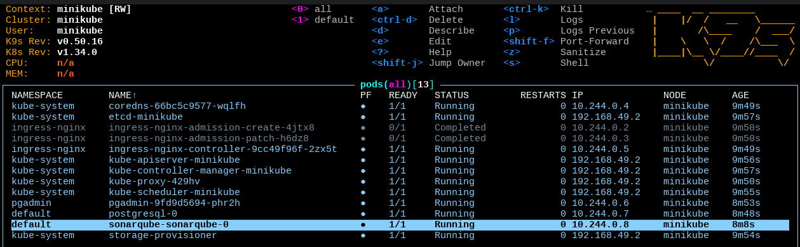

# SonarQube on Kubernetes Minikube Cluster

## About the Project

This project automates the setup of a local Kubernetes cluster using Minikube and deploys SonarQube with PostgreSQL backend using Terraform. It provides a complete code quality analysis environment in Kubernetes with web-based interfaces for SonarQube and PostgreSQL management.

## Components

- **Minikube**: Local Kubernetes cluster running in Docker
- **Terraform**: Infrastructure-as-Code for cluster deployment and configuration
- **SonarQube**: Open-source code quality platform with static analysis
- **PostgreSQL**: Database backend for SonarQube
- **pgAdmin**: Web UI for PostgreSQL database management
- **Nginx Ingress**: Routes traffic to SonarQube and pgAdmin

## Quick Start

### Screenshots

* A SonarQube instance is up and running within the Kubernetes cluster.
* The SonarQube instance is accessible via an HTTP endpoint exposed by the ingress controller.

#### SonarQube Dashboard


#### pgAdmin Dashboard


#### kubernetes cluster


### 1. Install Prerequisites

```bash
bash install-deps.sh
```

This installs:
- Docker
- kubectl
- Helm
- Go
- Minikube
- Terraform

### 2. Deploy Cluster

```bash
bash setup-minikube.sh
```

This script will:
1. Start Minikube with Docker driver and port mappings
2. Wait for cluster readiness
3. Enable Ingress addon
4. Initialize Terraform
5. Deploy PostgreSQL, SonarQube, and pgAdmin via Terraform
6. Display all running pods

### 3. Configure Local Access

Add these entries to your `/etc/hosts`:

```bash
echo "127.0.0.1  sonarqube.local" | sudo tee -a /etc/hosts
echo "127.0.0.1  pgadmin.local" | sudo tee -a /etc/hosts
```

## Access Services

After deployment completes, access:

- **SonarQube**: [http://sonarqube.local](http://sonarqube.local)
  - Username: `admin` (password: setup on first login)

- **pgAdmin**: [http://pgadmin.local](http://pgadmin.local)
  - Email: `user@domain.com` (password: in `pgadmin.yml`)

- **PostgreSQL**: `localhost:5432`
  - Username: `postgres` (password: in `secret.yml`)

## Configuration Files

| File | Purpose |
|------|---------|
| `install-deps.sh` | Prerequisites installation script |
| `setup-minikube.sh` | Minikube startup and Terraform deployment |
| `main.tf` | Terraform: Helm providers and chart deployments |
| `postgres.yml` | PostgreSQL Helm chart values |
| `sonarqube.yml` | SonarQube Helm chart values |
| `pgadmin.yml` | pgAdmin Kubernetes manifest |
| `secret.yml` | Database credentials as Kubernetes secret |

## Connecting pgAdmin to PostgreSQL

In pgAdmin web interface, use these parameters:

| Parameter | Value |
|-----------|-------|
| Hostname | `postgresql.default.svc.cluster.local` |
| Port | `5432` |
| Username | `postgres` |
| Database | `sonarDB` |
| Password | Check `secret.yml` |

## Kubernetes Pods Status

View running pods after deployment:

```bash
kubectl get pods

# Example output:
# NAME                             READY   STATUS    RESTARTS   AGE
# postgresql-0                     1/1     Running   0          2m
# sonarqube-xxxx-yyyy              1/1     Running   0          1m
# pgadmin-xxxx-yyyy                1/1     Running   0          1m
# ingress-nginx-controller-xxxx     1/1     Running   0          3m
```

Monitor specific pods:

```bash
kubectl logs -f deployment/sonarqube
kubectl logs -f statefulset/postgresql
kubectl get pod postgresql-0 -o wide
```

## Troubleshooting

| Issue | Solution |
|-------|----------|
| Services not accessible via hostnames | Verify `/etc/hosts` entries and DNS resolution |
| PostgreSQL connection failed | Check: `kubectl get pod postgresql-0` and verify `secret.yml` credentials |
| Ingress shows no ADDRESS | Verify: `kubectl get pods -n ingress-nginx` |
| Terraform apply fails | Run: `terraform destroy && terraform apply -auto-approve` |
| Minikube won't start | Ensure Docker is running and has sufficient resources |

## Useful Commands

```bash
# Cluster status
kubectl get nodes
kubectl get pods -A

# View logs
kubectl logs -f deployment/sonarqube
kubectl logs -f statefulset/postgresql
kubectl logs -f deployment/pgadmin

# Port forwarding (if needed)
kubectl port-forward svc/postgresql 5432:5432
kubectl port-forward svc/sonarqube 9000:9000

# Terraform operations
terraform plan
terraform destroy

# Minikube operations
minikube stop
minikube delete
minikube status
```

## Documentation

- [Minikube Documentation](https://minikube.sigs.k8s.io/)
- [Terraform Documentation](https://www.terraform.io/docs)
- [SonarQube Documentation](https://docs.sonarqube.org/)
- [PostgreSQL Documentation](https://www.postgresql.org/docs/)
- [pgAdmin Documentation](https://www.pgadmin.org/docs/)
